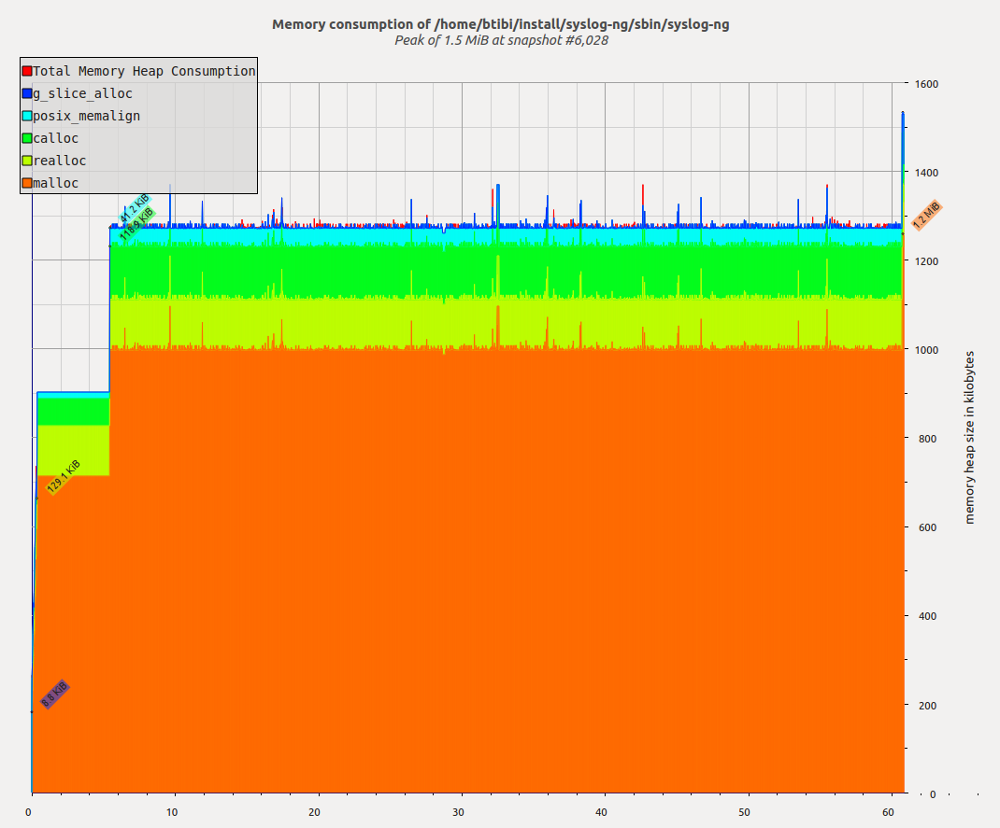

# Preparation

I suppose you have already cloned syslog-ng into a local repository and you
have all tools and libraries installed to compile syslog-ng.

## Creating debug builds

You need to have debug symbols included in syslog-ng in order to debug it
"efficiently". Step into your local clone and type the following commands:

```
$ ./autogen.sh
$ mkdir build
$ cd build
$ ../configure --enable-debug
$ make
$ sudo make install
```

The point is to pass the `--enable-debug` parameter to the `configure` script.

These commands will create a debug build under the `build` directory and
install syslog-ng under a system specific directory. Installation will require
superuser prviliges. 

## Installing and running without superuser privileges

You may need to test syslog-ng without having superuser privileges. You can
install syslog-ng into a custom location and run it without any privilege. This
solution is fine until you need to read from `/dev/log` or listen to ports
under 1024.

You can set the install location before the compilation process, just pass a
`--prefix=<the path where syslog-ng should be installed>` parameter to the
`configure` script.

```
$ ./autogen.sh
$ mkdir build
$ cd build
$ ../configure --enable-debug --prefix=$HOME/install/syslog-ng
$ make
$ make install
```

This way the `make install` command will not require superuser privileges and you can have
multiple versions from syslog-ng on your computer.

# Finding bugs

Unfortunately every software has bugs and syslog-ng is not an exeption. When
you report the problem to the developers they mighr need some extra information
to reproduce the issue in-house. In this section we introduce you to some frequently
used tools which may greatly simplify the bug hunting.

# Finding memory leaks

We suggest to use two tools to track down these problems. `Valgring` can detect
memory leaks and many other things, it is available on a lot of operating
systems but it greatly slows down syslog-ng. `heaptrack` is very convenient to
use, it is faster than `valgrind` but it is not distributed as a binary package.
You also need a Linux with a decent C++11 compiler.

## Installing valgrind

On most platforms you can use the native package manager to install `valgrind`.
On Ubuntu Trusty you need to execute the following commmand:

```
$ sudo apt-get install valgrind
```

On CentOS 7 just execute:

```
# yum install valgrind
```

## Running syslog-ng under valgring

You can run syslog-ng under valgrind with the following command.

```
G_SLICE=always-malloc valgrind --leak-check=full <the path where syslog-ng is installed>/sbin/syslog-ng -F
```

You may use other paramters.  The `G_SLICE` environment variable makes the
result nicer, because you will get less false positive results. The developers
are interested in valgring's output log.

## Installing `heaptrack`

You will need a compiler with `C++11` support. At least GCC 4.8 or clang 3.3 is required.

### Ubuntu 14.04

In order to install heaptrack you have to compile it yourself. On Ubuntu Trusty
the steps are the following:

```
apt-get update -y
apt-get install -y cmake \
                   g++ \
                   git \
                   libboost1.55-dev \
                   libboost-iostreams1.55-dev \
                   libboost-program-options1.55-dev \
                   libdwarf-dev \
                   libunwind8-dev \
                   software-properties-common

git clone git://anongit.kde.org/heaptrack.git /home/heaptrack
mkdir /home/heaptrack/build
cd /home/heaptrack/build
cmake -DCMAKE_BUILD_TYPE=RelWithDebInfo ..
make && make install
```

You may use other paths, not just `/home/heaptrack`.

### CentOS 7

The steps are the following:

```
yum install -y epel-release
yum install -y cmake \
               gcc-c++ \
               git \
               boost-devel \
               boost-iostreams \
               boost-program-options \
               libdwarf-devel \
               libunwind-devel \
               make

git clone git://anongit.kde.org/heaptrack.git /home/heaptrack
mkdir /home/heaptrack/build
cd /home/heaptrack/build
cmake -DCMAKE_BUILD_TYPE=RelWithDebInfo ..
make && make install
```

You may use other paths, not just `/home/heaptrack`.

## Running syslog-ng with `heaptrack`

You can run syslog-ng with heaptrack with the following command:

```
heaptrack <the path where syslog-ng is installed>/sbin/syslog-ng -F
```

It will create a gzip file and after you stopped it, it prints something like this:

```
...
  heaptrack_print -l /home/milian/heaptrack.yourapp.12345.gz | less
```

The output of `heaptrack_print` provides you with a lot of information about memory
leaks. The Gzip file will be huge (some gigabytes or more) and `heaptrack_print`
will fully consume one of your CPUs when it runs. It is not as slow as valgrind
but you will notice the decreased performance.

You can generate nice and useful graphs with `heaptrack`. To do this, run pass the
`-M` option to it. The massif-visualizer program can parse the output file and
create diagrams like this:



You can fine-tune the result with `--massif-threshold` and `--massif-detailed-freq`.

If you are interested in heaptrack, you can find more information here:

http://milianw.de/blog/heaptrack-a-heap-memory-profiler-for-linux
